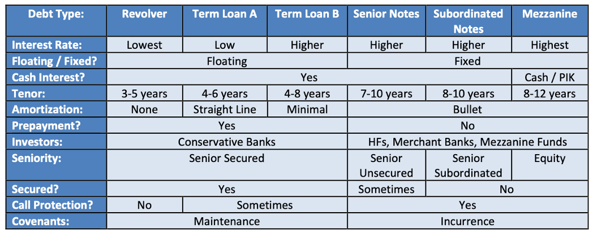
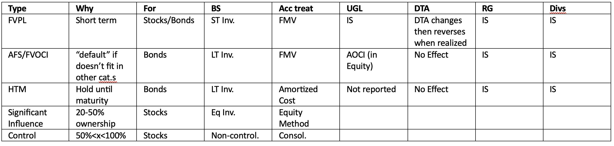

## Face value vs book value of debt
- Face Value: Amt company initially issues and pays interest on
- Book Value: amount shown on the balance sheet (incl. amortization of debt issuance fees, loss on debt extinguishment, and debt principal repayments)
    - Loss on debt extinguishment is penalty they pay equal to remaining unamortized issuance fees
- Market Value: based on the PV of its future cash flows
    - Impacted by discount rate, expected future cash flows, repayment probability upon maturity
    - Makes NO impact to financial statements

### When issuing debt
1.	Company pays issuance fees to banks and lenders
2.	Issuance fee deducted from the debt number that goes on the balance sheet (book value)
    - Debt line items keep increasing each year because of this
    - If debt is repaid early, then it records a loss on debt extinguishment equal to remaining unamortized issuance fees
3.	On CFS, both amortization of issuance fees and loss on debt extinguishment are non-cash add-backs, add back anything to do with the issuance fees

### OID
1.	IF there is a difference between coupon rate on the debt issuance and prevailing yields at the time of initial issuance, then OID might be issued
    - Investor buy $100 debt for $95 (5% OID), still earn interest on $100 face value
    - Accounting treatment similar to issuance fees, deduct the OID from Face Value to get book value, and then amortize the OID until debt’s maturity
2.	On IS, amortization of OID counts as an interest expense, and it’s a non cash add back on the CFS
3. Equity portion is the debt discount
4. Conversion into shares doesn’t cause any cash flow impact, only issuances/maturities/fees do
5. Liability and equity components both get transferred into common shareholders’ equity if there is a conversion, but liability component is adjusted for the amortization and loss items in year 3 (?)

### When a convert is issued, it’s split into debt and equity components
- The debt component keeps increasing due to the amortization of the debt discount issuance fees, and it reaches the face value if the bond matures without being converted
- If the bond is converted into common shares, the debt component and equity component are both transferred into CSE because capital is now considered 100% equity

 
- PIK interest increases both the face value and the book value of debt in each period

(review these debt schedules)

## Equity Method of accounting
||Ownership||	
|--|--|--|
|Equity Method|	less than 50%|	IS: ownership% * Sub Income, CFS: reverse this line, record ownership% * Sub dividend, BS: creates asset, increases by equity investment earnings, decreases by dividends
|Consolidation|	more than 50%	
|Treated as a security on BS|	Small %	

### If market cap increases:
- Change does not appear on IS, unless parent sells some of the stake based on the new market cap
- Unrealized gains and losses on equity investments do not appear, only realized gains and losses

### If ownership % changes:
1.	To calculate realized gain/loss, first get cost basis:	
    - Equity investments in previous period, add the equity investment earnings and subtract dividends
2.	Intuitively, you find the original value of the stake bought and deduct the new value now, and then adjust for the % of the stake you actually sell
3.	3FS:
    - IS: add realized gains/losses on IS, equity investment earnings will change because ownership % changes
    - CFS: reverse all gains and losses, normal earnings/dividends line items also show up here
    - BS: Earnings/Divs/Gains&Losses/Purchases&Sales all flow into balance sheet item

## Consolidation
- 	Financial statements are consolidated 100%
    - IS: deduction of (1-ownership%) * sub net income
    - CFS: reverse this line item because parent does get the net income in cash. Combine dividends of parent and sub, also add sub co’s dividends * ownership%
    - Balance sheet (see below)

## Consolidation process
1.	Write down sub equity
2.	Add new good will
3.	Eliminate old equity investments
4.	Deduct cash used to fund deal
5.	Add debt
6.	Add common stock issued
    >- NOTE: Asset side, debit means add, credit means subtract (when you add an assets, you pay up “debited”)
    >- Liabilities, debit means subtract, credit means add
    >- Deduct the equity investments line
    >- CSE will record the discount/premium to book value of existing stake

|Statement|Impact|
|--|--|
|Income Statement|
|Balance Sheet|CSE: common shareholder’s equity + retained earnings – parent divs – stock repurchase + stock issuance (leave out sub divs) NCI acts as a mini-shareholders’ equity line item for minority shareholders in sub co.
|Cash Flow Statement| Dividends: add dividends from the ownership% * sub dividends because we do not actually lose 100% of dividends, Equity investment earnings and NCI, Divs from partially owned companies, Cash:

>If >50% impacts:
>NCI
>Equity iinvestments

### De-consolidation, move back below 50% ownership
1.	Noncontrolling interest is removed, and a new equity investment line item is created
2.	Need to assume a market cap for this sub co. when ownership change takes place at end of 4 year period
3. Gain/Loss calculation: Market value of stake sold + market value of new equity investment + book value of NCI being removed – net assets of sub (including goodwill created in previous deal)
    -	Why even add the book value of the NCI (?)
    -	Net assets of sub is the cost basis
    -	Only pay tax on the gains

### Stock Based Compensation
-	Not cash tax deductible when issued
-	But complicated when employees exercise their options
    - Net income can exceed pre-tax income
    - Book taxes can be positive on the IS rather than -ve

|GAAP|	IFRS|
|--|--|
|Calculate DTA, Calculate excess tax benefits/(deficiencies), and then add the tax benefit to post-tax income|Value of the DTA changes whenever the value of SBC changes, Tax benefits on the IS show up only when the SBC first meets or exceeds its grant value. Tax deficiencies appear if its value falls
|Cash Tax benefits of SBC is a +ve entry that offsets income taxes on IS|Cash Tax benefits of SBC is a +ve deferred tax adjustment on the CFS

### Unrealised gains/losses on financial investments
-	Realized gains/losses: record the gain/loss on income statement > reverse on CFS > show total amt of proceeds received in CF from investing > link items to corresponding asset on BS
-	Unrealized gains/losses:
    - Fair Value through profit & Loss: UGL appear on the IS but does not impact cash taxes, DTA/DTL changes and then reverses when GL are realized
    - Fair Value through other Comprehensive income: UGL flow into AOCI within CSE and affect the corresponding asset on the other side. Nothing appears on the IS
    - Held to Maturity: UGL are not recorded anywhere, company adjusts the assets as it receives principal repayments (used for bonds)

	

## Pension accounting

### Pensions: promise of future payments to employees for work they do today, like SBC except they pay them in cash instead of stock in the future
-	Defined Contribution (easy)
    - Set aside salaries, invest funds independently, withdraw in retirement
    - Shows up as operating expense on IS
    - No LT Pension assets/liabilities because employees responsible for everything
-	Defined Benefit
    - Promises specific payments to employees in the future based on current salaries and years of work at the company
    - Need to add unfunded pension obligation (Pension Liability – Pension Asset) to the EV, possibly multiply by (1-Tax)
    - EV multiples should only deduct the pension service cost and not the interest/finance cost (Why?)

### DB asset:
- Add return on plan assets
- Add employer contributions
- Add participant contributions
- Deduct benefit payments

### DB Liability:
- Add service cost (additional cost accrued each year as employees stay longer, not a cash expense, because it just represents the accrual of future payments, but it is an operational expense)
- Add interest cost (how the company moves closer to the payout of the full pension benefits each year)
- Deduct/add actuarial gain/loss (adjustments for payments that are above or below expectations)
- Add participant contributions
- Deduct benefit payments

### On the IS:
1.	[OpEx] Pension Service Cost
2.	[Other income/expense] 
    - Interest Cost
    - Expected Return
    - Amortization of losses (difference between actual returns and expected return shrinks, this shrinks, and vice versa)
    - Amortization of prior service costs
    - Settlement Charges
3. DTA gets created because IS pension expenses are not tax deductible (Pension contributions are)

### Main line items to focus on:
- Service Cost
- Interest/Finance Cost
    - Expected return
    - Amortization of expected vs actual returns
    - Other line items below EBIT
- Employer Contributions
- Pension Benefit Payments
- UGL on Pension assets

### GAAP vs IFRS
- More random
- No amortization of actual vs expected returns, annual diff goes into AOCI
- Taxes
