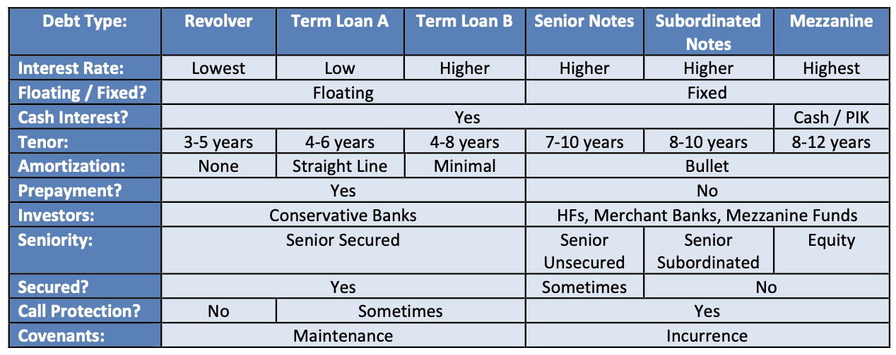

|Types|Repayments|
|--|--|
|Senior Secured Debt|Mandatory repayments
|Term Loans|Mandatory Debt Repayments
|Senior Debt	
|Subordinated Debt	
|Hybrids	
|Equity	

*Which ones have maintenance covenants? And which one needs principal repayments?*

### Debt vs Equity
1.	Debt tends to be cheaper than Equity because lenders target lower returns
2.	But debt also incurs a cash cost
3.	Debt comes with many restrictions
4.	Equity does not create a fixed cost for the business in the future
5.	Some companies can’t issue debt because of covenants

### Picking between debt types
1.	If can’t comply with DSCR, might still be able to do Junior debt which has higher rates but no principal repayments
2.	If too much debt already can use Mezzanine debt higher rates through PIK
3.	If no growth potential will be hard to issue convertibles

### Decision tree
1.	Calculate after tax costs of debt and equity
2.	Cash flow projection model with operational scenarios
3.	Build debt schedule to track interest expense, repayments, and debt and cash balances
4.	Examine credit stats and ratios in different scenarios
5.	If breach requirement, consider alternate structures
6.	If converts not viable think about mix of debt and equity

### Debt Schedule
1.	Cash beginning of period
2.	+ FCF
3.	– Maturities and Mandatory Repayments 
4.	– Minimum Cash
5.	Cash flow available for Debt Repayment
6.	Then pay off new term loans and subordinated notes

### Covenants
1.	Debt/EBITDA
2.	Net Debt/EBITDA
3.	EBITDA/Interest
4.	DSCR (Free cash flow – dividends + interest Expense) / (mandatory debt repayments and maturities + Interest Expense) add back interest expense because measures how much cash flow you have for debt service

### Bond analysis
- Par value, Yield
- Look at the model

|Interest rate vs coupon|Bond price|
|--|--|
|Interest Rates more than Coupon| Bond trades at discount to par
|Interest Rates less than Coupon|Premium to par
|Interest Rates = Coupon|	At Par

1.	Current Yield = coupon rate * par / market price of bond
2.	Yield to Maturity = IRR of a bond
	- (Annual interest + (redemption value – bond price/ # to maturity)) / (avg of redemption value and bond price)
	- Assumes hold to maturity, reinvest all cash flows at same YTM, company makes all interest and principal payments in full on the scheduled dates
3.	If Bond trades at discount to par then YTM > Current Yield > Coupon Rate
4.	If bond at par then YTM = Current Yield = Coupon Rate
5.	If Bond trades at premium to par then YTM less than  Current Yield less than  Coupon Rate

### Duration and Convexity
-	Duration is first derivative of bond’s price with respect to YTM
	- Longer duration menas more interest rate risk (?why)
-	Convexity is second derivative of bond’s price with respect to YTM
	- Declining rates have more of an impact on bond’s market price than rising interest rates

### Calling a bond
1.	Yield to worst
2.	Redemption premiums
3.	Call protection
4.	Make-Whole provisions

### Debt Comps
1.	Industry/Geography, timing, credit rating
2.	Median Coupon Rate, Offer amount, bond price, maturity, YTW, YTM and interest and coverage ratios

### Convertibles
1.	Coupon Rate
2.	Maturity
3.	Conversion Price
4.	Conversion Premium
5.	Par Value
6.	Conversion Ratio
7.	number of Convertible Bonds
8.	Diluted Shares from Converts

### Value of a convert
1.	Convertible bond value = value of the traditional bond + value of conversion option, increased volatility will increase value of the conversion option
2.	Convertible bond is less valuable if its conversion price and stock price are further apart
3.	Lower maturity makes it less valuable

### Hedging dilution 
-	Use a call spread:
	- Buys call options on stock
	- Sells warrants on the stock at a higher exercise price to offset cost of call options
