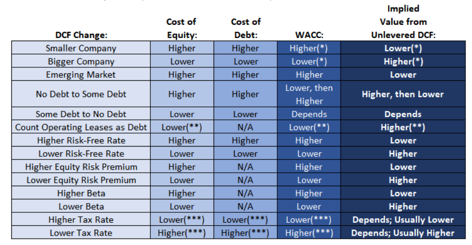

## FCF

### Levered FCF
1.	EBT * (1-T) + D&A + change in Working capital -CapEx - debt repayments
Unlevered FCF
1.	Include only recurring items that are related to the company’s core business and that are available to all the investor groups
a.	So ignore things like other income, cash flow from investing
b.	SBC should be considered a cash expense even though it is a non cash add back on CF because it creates additional shares
2.	Multiple EBIT By (1-Tax rate) + D&A + change in Working Capital - CapEx

### NOLs in FCF
1.	You can set up NOL schedule and apply NOLs to reduce cash taxes, and factor in NOL accruals if negative prpe-tax income
2.	But easier to just add NOLs as non-operating assets in the bridge

### Pensions in FCF
1.	Operational Components- Service Cost:
a.	Should be deducted in both types of FCF and then added back as a non-cash expense
2.	Non-Operational Components:
a.	Exclude in unlevered DCF
3.	If a pension plan is unfunded, subtract unfunded portion when moving from implied enterprise value to implied equity value
4.	In levered FCF everything must be deducted

>Gordon Growth formula, TV = Final year FCF * (1+ Terminal Growth Rate) / (Discount rate – terminal growth rate)

### If you subtract a certain expense in the FCF, you should ignore the corresponding liability when moving from implied enterprise value to implied equity value at the end
- Just subtract full expenses associated with leases directly within UFCF
- Only add back D&A on owned assets and not the lease D&A

### UFCF differ for US and non US
1.	Treatment of operating and finance leases
2.	IFRS find and deduct the interest element of operating and finance leases and adding back D&A on owned assets only

**CoE:**	Risk Free Rate + ERP * levered beta

**CoD:**
	

### Beta
1.	Levered beta, intrinsic business risk and risk from leverage
2.	Unlevered beta, only intrinsic business risk
3.	Has nothing to do with levered or unlevered FCF because company’s cap structure affects both the cost of equity and WACC, capital structure neutrality is a property of the FCF not the discount rate

> Unlevered Beta = Levered Beta / (1 + D/E * (1-T))

> Levered Beta = Unlevered Beta * (1 + D/E * (1-T))

### Leases
1.	Finance leases impact is small
2.	Operating leases more significant
3.	Cost of Debt the same
4.	Cost of Equity same or decrease slightly, because unlevered beta will be lower if leases are a form of leverage
5.	WACC usually decreases

> Unlevered Beta = Levered Beta / (1 + D/E * (1-T) + Leases/Equity *(1-T))

> Levered Beta = Unlevered Beta * (1 + D/E * (1-T) + Leases/Equity*(1-T))

### CFADR
> FCF + beginning cash – min cash

### Fundamental value eqn:
> Value of Company = (Cash Flow) / (Discount rate – cash flow growth rate)

### DCF Factors
1.	Discount rate and TV make biggest impact to DCF
2.	If company has debt, tax shield will benefit CoE/CoD/WACC, but lower cash flows

/Skipped a bunch/

### Leases
1.	Large portfolio off leases with varied start and end dates, lease interest + depreciation will be fairly close to the rental expense
2.	Count leases as a source of capital > add back lease expense > deduct lease capital from the EV to EQ bridge

### IFRS vs GAAP
1.	Biz model and financial model differences
2.	Unlevered FCF, must deduct the full lease expense for IFRS, interest elements of both finance and op leases, add back only the non-lease D&A
3.	Terminal value and sensitivities, you might use higher FCF growth rates in emerging and frontier markets
4.	For comps, need to add op and finance leases to EV since EBITDA includes the lease expenses
