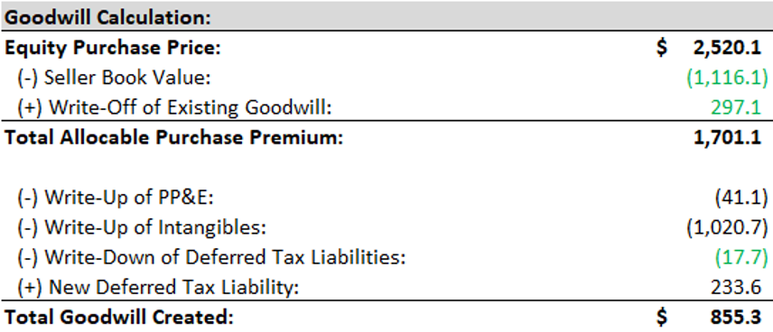

## M&A

### Walk through a merger model
1.	Project financial statements of buyer and seller
2.	Estimate purchase price and mix of dungin to fund the deal
3.	Sources and Uses + PPA schedule to estimate true cost osf the acquisition and after effects
4.	Combine balance sheets to reflect cash, debt, sotck used, any new good will created and any write ups and write downs
5.	Combine the income statements
	- Reflecting foregone interest on cash, interest paid on new debt and synergies
	- If new debt balance changes over time, interest paid on new debt should reflect that
6.	Combined net income equals the combined pre tax income * (1-buyer’s tax rate)
	- Divide by buyer’s share count + any shares issued to get the new EPS

|Accretive|	Dilutive|
|--|--|
|Extra pre-tax income from seller|Foregone interest on cash
||Interest paid on new debt
||New shares issued

*Cost of Cash:* Foregone interest on cash * (1-Buyer’s tax rate)

*Cost of Debt:* Interest rate on new debt * (1-Buyer’s tax rate)

*Cost of Stock:* Reciprocal of buyer’s/seller’s P/E

### How to determine mix
- Cash available = acquirer’s current cash – min. cash balance and add target’s cash if it’s significant
- Debt = raise Debt up to the level of Debt / EBITDA, ICR they target
- Stock = no limit, but they might have dilution concerns

### Which method preferred by sellers
- Taxes vs certainty vs potential of future upside 

### Considerations besides EPS accretion/dilution
1.	Alr negative EPS
2.	Buyer is far bigger
3.	Qualitative merits
4.	Contribution analysis (?)
5.	Value Creation analysis (?)

### Problems with merger models
1.	EPS not reflective of Cash Flow
2.	Don’t capture qualitative risks
3.	Doesn’t capture share price changes

### How Multiples change with change in financing
1.	No change to TEV/EBTIDA
2.	P/E changes based on stock issued and cash and debt used

|Combined Equity Value|	Combined Enterprise Value|
|--|--|
|Buyer’s equity value + Market value of stock issued in the deal|Always Ent value of Buyer + Ent value of Seller
||Ent value of the seller changes if premium is paid

### Post deal combined Multiples
- Will be between the buyer’s standalone multiples and the seller’s purchase multiples
	- Ent value will not be impacted by financing structure
	- Equity value will be impacted by adjustments to interest paid on new debt and foregone interest on cash

### Real Price of an M&A Deal

- Buyer repays seller’s debt with own cash, or issues stock to do so, and uses all of Seller’s cash
	- Real price will be close to Purchase Ent Value
- Buyer replaces seller’s debt with new debt, only some part of seller’s cash used to fund deal
	- Real price between purchase equity value and purchase enterprise value

### Cash free, debt free deal for private seller
1.	Seller’s existing cash and debt both go to 0
2.	Based on TEV/EBITDA rather than share price premium
3.	S&U table based on purchase enterprise value on the Uses side rather than the Purchase Equity Value

### Purchase Price Allocation Schedule
1.	Estimate the Goodwill created in the deal
2.	Get allocable purchase premium,
	- Subtract write up of PPE, intangibles (asset write up mean less goodwill needed)
	- Write down existing DTLs and add in new DTLs (liabilities increase mean more goodwill needed)
 
 

### Negative Goodwill
-	Does not exist, recorded as extraordinary gain
	- Reverse on CFS
	- Reverse additional book taxes paid
- B/S works the same way, don’t record any goodwill
	- Increased CSE, and DTL changes based on adj. to deferred tax line item

### Main adjustments when combining balance sheets (?)
1.	Cash Debt Stock used in the deal
2.	Create new goodwill
3.	Write up assets
4.	Reflect Sellers assumed or refinanced debt
5.	Write off existing DTLs and DTAs, show any new DTLs
6.	Write down seller’s CSE and reflect transaction and financing fees

### Issues with IRR vs Discount rate
1.	Not clear which discount rate to use
2.	Treatment of synergies (who gets credit) and terminal value (should there be terminal value)

### Contribution analysis
1.	Add up financial metrics such as Revenue/EBITDA, determine the % buyer and seller contribute to each combined metric
2.	Estimate pro-forma combined Ent Valu based on contribution %
3.	Compare vs offer price

## Advanced Questions

### Buyers prefer asset purchases, sellers prefer stock purchases
1.	Reduces transaction risk for buyers
2.	Buyers can deduct D&A on asset write ups for cash tax purposes in an asset purchase
3.	Sellers prefer stock purchases because asset purchases leaves them with more risk after deal close

### NOLs (?)
1.	Calculate the DTA from NOL using tax rate and NOL balance
2.	Calculate how much you can use a year using rates * purchase price
3.	NOLs expire in 5 years, multiply by previous to get total usable
4.	If Seller huge NOL balance, might opt for stock purchase, but if NOL balance is small, asset purchase might make sense

|Type|Treatment|
|--|--|
|Stock Purchase|	Allowable annual NOL usage = Equity purchase Price * Highest of past 4 month’s adjusted long term rates
|Asset Purchase|	Seller’s NOLs are written 100%

### Earn-outs
1.	Used if buyer and seller disagree about seller’s future financial performance
2.	Contingent consideration is recorded on the L&E side and increases amount of goodwill required for PPA schedule
3.	Reduction in 60m contingent consideration
	- Income Statement
		- +45 (post tax 25%)
	- CFS
		- +45 (net income)
		- -60 (non-cash)
		- +15 (25%*60) tax add back
	- B/S
		- Balance sheet DTAs down by 15
		- L&E +45, -60 (contingent consideration down by -60, CSE up by 45)

### Floating vs Fixed Exchange Ratios
1.	Fixed exchange ratio, seller receives a constant amount of shares, seller’s ownership will stay the same regardless of buyer’s share price, but purchase price could change
2.	Floating exchange rate, seller receives a fixed purchase price but variable number of shares
